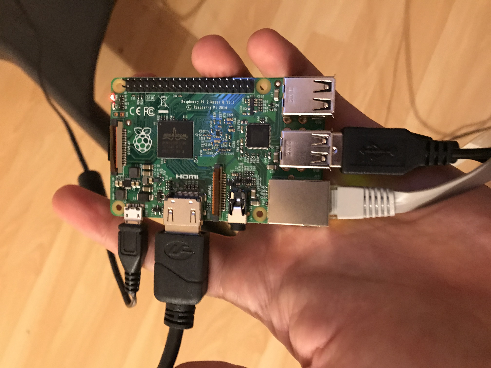
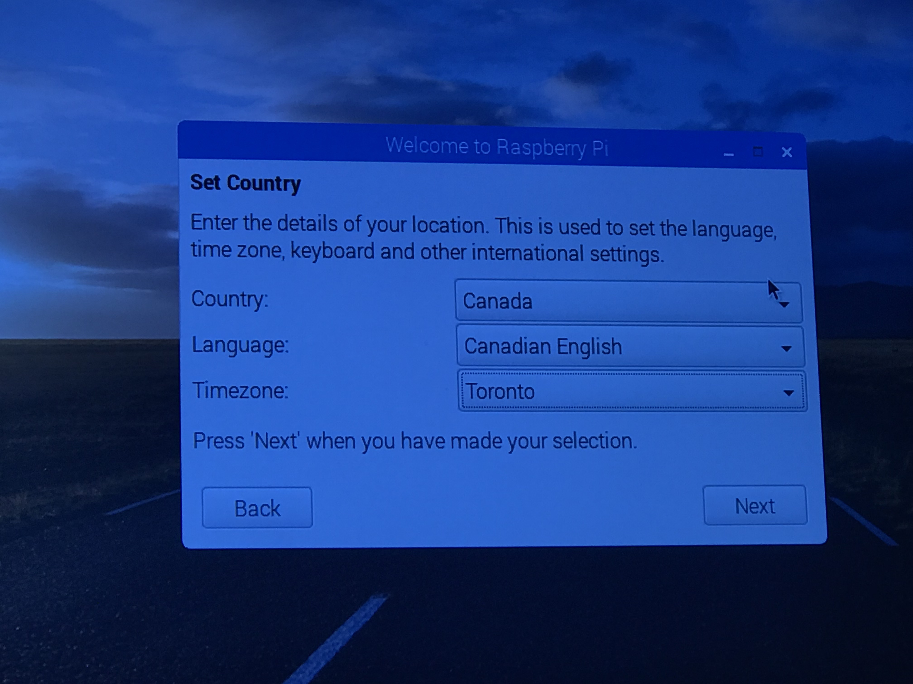

# Treasure Box Braille Raspberry Pi Setup

## How to setup for use

1. Download all image files available in the [Release](https://github.com/PiETLab/TreasureBoxBrailleSetup/releases) page
  * `RASPBERRY-RELEASE-IMAGE.zip` and `RASPBERRY-RELEASE-IMAGE.z01`

2. Download an app to unzip spliced zip files
  * Windows: [7-zip](http://www.7-zip.org/)
  * MacOSX: [The Unarchiver](https://itunes.apple.com/us/app/the-unarchiver/id425424353?mt=12)

3. Unzip `RASPBERRY-RELEASE-IMAGE.zip`
  * 

4. Write the outputted `raspbian.img` image to an SD card
  * You will need to use an image writing tool to install the image you have downloaded on your SD card.

  * [Etcher](https://etcher.io/) is a graphical SD card writing tool that works on Mac OS, Linux and Windows, and is the easiest option for most users. Etcher also supports writing images directly from the zip file, without any unzipping required. To write your image with Etcher:

    1. Download [Etcher](https://etcher.io/) and install it.
    2. Connect an SD card reader with the SD card inside.
    3. Open Etcher and select from your hard drive the Raspberry Pi `.img` file you wish to write to the SD card.
    4. Select the SD card you wish to write your image to.
    5. Review your selections and click 'Flash!' to begin writing data to the SD card.
    

5. Plug the SD card to the Raspberry Pi and enjoy!

## How to setup a unit for development

1. Get a Raspberry Pi and a fresh Micro SD card (8gb is enough)

2. Get a copy of [Raspbian](https://www.raspberrypi.org/downloads/)
  * We will use the easy installer for Raspbian which is called `NOOBS`.
  * Tested version = 2.8.2 (Offline and network install)
    * [Download link](https://downloads.raspberrypi.org/NOOBS_latest)

3. Once you've downloaded the NOOBS zip file, you'll need to copy the contents to the formatted SD card on your computer.

4. To set up a blank Micro SD card with NOOBS:

  * Format an SD card which is 8GB or larger as FAT. See the instructions given below.
  Note: If you're formatting an SD (or micro SD) card that has a capacity over 32GB (i.e. 64GB and above), then see the separate SDXC formatting instructions.

    * **WINDOWS**
      * If you are a Windows user, we recommend formatting your SD card using the SD Association's Formatting Tool, which can be downloaded from [sdcard.org](https://www.sdcard.org/downloads/formatter_4/). Instructions for using the tool are available on the same site.

    * **MAC OS**
      * The [SD Association's Formatting Tool](https://www.sdcard.org/downloads/formatter_4/) is also available for Mac users, although the default OS X Disk Utility is also capable of formatting the entire disk. To do this, select the SD card volume and choose Erase with MS-DOS format.

    * **LINUX**
      * For Linux users we recommend gparted (or the command line version  parted). Norman Dunbar has written up [instructions](http://qdosmsq.dunbar-it.co.uk/blog/2013/06/noobs-for-raspberry-pi/) for Linux users.

  * Download and extract the files from the NOOBS zip file.

  * Copy the extracted files onto the SD card that you just formatted, so that this file is at the root directory of the SD card. Please note that in some cases it may extract the files into a folder; if this is the case, then please copy across the files from inside the folder rather than the folder itself.

  * On first boot, the "RECOVERY" FAT partition will be automatically resized to a minimum, and a list of OSes that are available to install will be displayed.

  * You can find further instructions for this step at [NOOBS](https://www.raspberrypi.org/documentation/installation/noobs.md) website.

5. Setup your Raspberry Pi

  * Insert the micro SD into the board
    * 
  * Connect a keyboard, mouse, ethernet cable and  A/C power supply
    * 
    * 
  * Turn on your monitor and you should see a setup screen like the following:
    * 
    * Select `Raspbian [RECOMMENDED]` and click on the `Install` button
    * 
    * Click on the `Yes` button, and you should see the following screens next:
    * 
    * 
    * After that you should select and language preferences and Raspbian will be fully functional
    * 

6. Check Raspberry Pi internet connection and install required packages
  * To check your internet connection open the `Terminal` application (left upper corner) and enter the command `ping 8.8.8.8`. You should see the following result:
  *   
  * After that, type the following commands in the terminal one at a time:
    * `sudo apt-get upgrade && apt-get update`
    * `sudo add-apt-repository universe`
    * `sudo apt-get update`
    * `sudo apt-get install wget`
    * `sudo apt-get install unzip`
    * `sudo apt-get install jq`
    * `sudo apt-get install oracle-java8-jdk`
    * `sudo update-alternatives --config java`
    * `sudo apt-get install at`
      * If it asks for permission, type `Y` for `Yes`

7. Setup `SCALP` files
  * `cd /home/pi`
  * `git clone https://github.com/PiETLab/TreasureBoxBrailleSetup`
  * `mv TreasureBoxBrailleSetup/SCALP.sh TreasureBoxBrailleSetup/startSCALP.sh TreasureBoxBrailleSetup/unmountDrive.sh TreasureBoxBrailleSetup/changeconfig.sh TreasureBoxBrailleSetup/config.txt .`
    * Moving files from the `TreasureBoxBrailleSetup` folder to `/home/pi`
  * `mv TreasureBoxBrailleSetup/enamel.desktop .config/autostart/`
  * `sudo mv TreasureBoxBrailleSetup/enamel_usb_autostart.rules /etc/udev/rules.d/`
  * `spruce_type=SCALP`
  * `wget $(curl -s https://api.github.com/repos/PiETLab/TreasureBoxBrailleApps/releases/latest | jq -r ".assets[] | select(.name | test(\"${spruce_type}\")) | .browser_download_url")`
    * Check the [releases page](https://github.com/PiETLab/TreasureBoxBrailleApps/releases/latest) for the latest release available
  * `unzip SCALP.zip && rm -rf SCALP.zip`
  * `cd Enamel`
  * `java -Dpi4j.linking=dynamic -jar Enamel.jar START_FACTORY FactoryScenarios/`
    * The `-Dpi4j.linking=dynamic` flag is necessary because the pi4j version in use is deprecated
      * Read more about it [here](https://www.raspberrypi.org/forums/viewtopic.php?t=182191)

## How to setup the hardware

* Check the tutorial video bellow:
* 

## Documentation - SCALP Program Functions

### Starting SCALP

  * **The Select-(as per)-Config-and-Launch-Player (SCALP)** application is a suite of files that work together to create a cohesive function. It allows the user to select a scenario file for the program to play, as well as change the settings of SCALP, using buttons or keyboard keys.

  * **Structure**: It consists of the following files, with file serves a particular function:

  * **SCALP.sh**
    * Examines config.txt, which contain configuration variables, and acts accordingly to both config.txt and the current state of the Raspberry Pi. The current state can be either: the system has just booted up, or a USB flash drive was inserted, or the system has booted up with a USB flash drive inserted.
  *	**changeconfig.sh**
  *	**startSCALP.sh**
    * This script calls `SCALP.sh`
  *	**unmountDrive.sh**
  *	**enamel.desktop**
    * Simply runs SCALP.sh at boot up.
  *	**enamel_usb_autostart.rules**
    * Runs SCALP.sh when a USB flash drive is inserted, or runs unmountDrive.sh when a USB flash drive is removed.
  *	**config.txt**
  * **Enamel.jar**
    * Enables the user to interact with the SCALP program, giving audio feedback and allowing the user to provide input using hardware buttons (connected by Raspberry Pi’s GPIO pins), or through keyboard keys if the current system the program is being run on is not a Raspberry Pi. Enamel.jar also includes an option within to change the variables in the config.txt file by using changeconfig.sh.

### Starting SCALP

  * The SCALP Java program is started in two ways:
    * **On device boot**
	  * **On insertion of USB flash drive**.
    If an instance of SCALP is already running, another start of SCALP will shut down the previous instance. For example, if you were in the middle of a scenario and you decide you want to play another file stored on a flash drive, simply inserting that flash drive will restart SCALP automatically, allowing you to select the scenario file in the flash drive.

    * **Note that a blank Java program will open, a window with no components inside**. This is normal; this is to allow the program to listen to keyboard key presses. As such, the **Java window must be in focus for the keyboard keys to work**. This is done by default, but if you switch focus to another window, just note that it will not work.

### Entering Input

  * If you are using SCALP on the ENAMEL device, the program will recognize it and allow you to use the physical buttons on your device. Otherwise, the keyboard row’s keys can be used instead, which again will need the blank Java program window open and in focus. The program speaks out loud the instructions. Depending on the current menu, the buttons will behave differently.

###  The different modes of SCALP

  * SCALP has several modes, which depend on the current state of the system, as well as the current settings (see 2.4). The default behavior is as follows:

    * If there is no USB flash drives inserted, SCALP will only look at files on the device. The files it looks for are in two directories: FactoryScenarios and USBBuffer.

    * If there are no files in the USBBuffer directory, SCALP will ignore the “high level selector” and simply begin the program with the FactoryScenarios directory. This directory contains scenario files that are pre-loaded onto the device. You can cycle through the scenario files contained in FactoryScenarios using the buttons, and select which one to begin playing.

    * If there are files in the USBBuffer directory, SCALP will start in “high level selector”. In this mode, the first option presented is selecting between FactoryScenarios or USBBuffer. Once the option is selected, again you can cycle through the scenario files in that directory.

    * If there is a USB flash drive inserted, then SCALP will only cycle through the files contained on the USB flash drive. If you do not want to play any of these scenarios, you can unplug the USB flash drive and the program will restart.

    * If the flash drive contains exactly one scenario, SCALP will select that scenario automatically and offer only a confirmation option to begin playing it.

    * If there are more than one scenarios on the flash drive, SCALP will copy the files over into the USBBuffer directory, and then start in “high level selector”. This is for convenience; once you hear the instructions for “high level selector”, this indicates that the files have finished copying over and you can remove the flash drive at any point. You do not have to keep the drive plugged in the whole time!

    * The scenarios on the flash drive must be kept in its root directory (i.e. not inside folders), and the audio files for the scenario must also be kept in a folder that’s in the flash drive’s root directory. If any other, non-scenario files are on the flash drive, as long as they are not in.txt format, it is not required to remove the non-scenario files before plugging it into the device.

    * Note: By default, the device will only store 10 scenarios in USBBuffer. This is to make it manageable, and not fill up the microSD card the Raspberry Pi runs from. This is changeable in settings. The oldest scenario file is deleted if the number of files goes over 10.

### Settings

  * SCALP has a configuration file called **config.txt** that contains the default behavior variables. Through the SCALP Java program, at any point in the program you may press the third button to enter settings. Again, the voice will guide you through the options. The settings that are changeable are as follows:

	 * Turn off/on auto-playing from the flash drive when there’s only one scenario file.
	 * Turn off/on auto-copying from the flash drive when there’s more than one scenario file,
	 * Changing the USBBuffer’s size (between 5, 10, 15, 20), meaning you can choose to store more or less scenario files.
	 * Turn off/on “smart clobber”. Smart clobber means that, when you plug in a flash drive, and the files on the drive and the files in USBBuffer are matching, those files will not be copied over. Comparison is done by date modified, meaning two scenarios (one in USBBuffer and one in the flash drive) with the same name but different content will not override the USBBuffer directory’s scenario.
